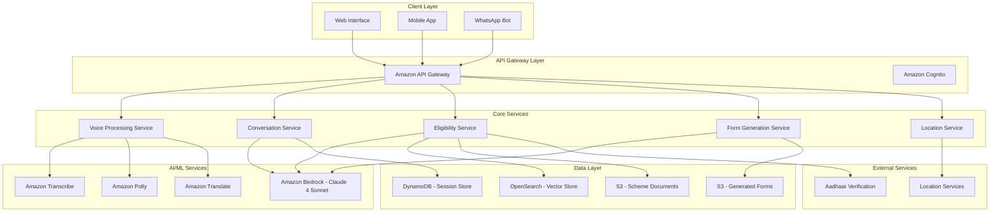
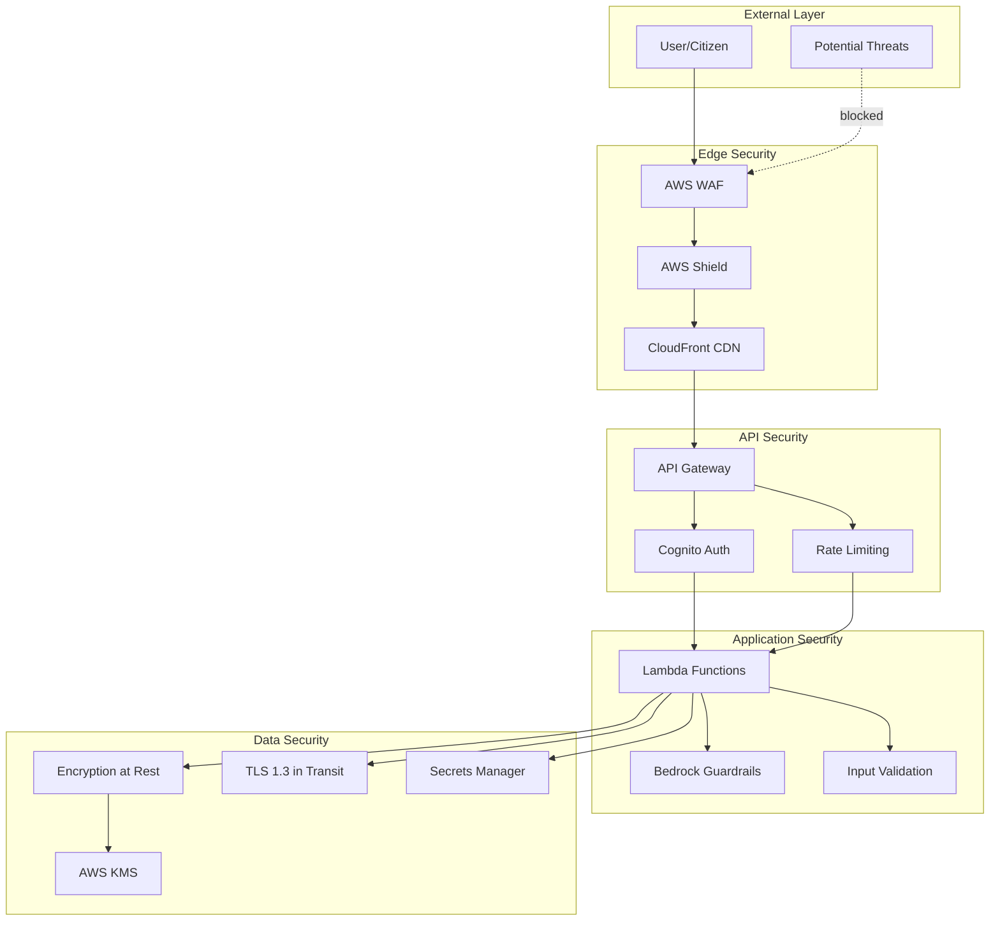
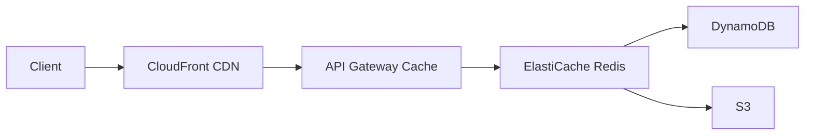
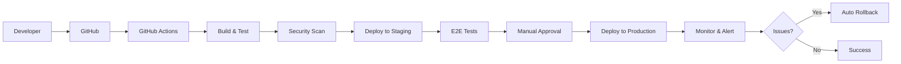

# Design Document: JanSeva AI

## Overview

JanSeva AI is a serverless, voice-first AI assistant built on AWS that helps Indian citizens access government welfare schemes through natural conversation. The system leverages Amazon Bedrock's Claude    4 Sonnet for intelligent conversation, combined with AWS speech services for multilingual voice interaction, and a RAG (Retrieval Augmented Generation) system for accurate scheme information retrieval.

The architecture follows a microservices pattern with event-driven communication, designed to handle high concurrency while maintaining low latency for rural users with limited connectivity. The system processes voice input in 10+ Indian languages, performs intelligent eligibility matching across 3,000+ schemes, and generates pre-filled application forms through conversational interaction.

## Architecture

### High-Level Architecture



### Service Architecture Pattern

Each core service follows a consistent serverless pattern:
- **AWS Lambda** functions for compute
- **Amazon EventBridge** for service communication
- **Amazon DynamoDB** for session state
- **Amazon S3** for document storage
- **Amazon CloudWatch** for monitoring and logging

## Components and Interfaces

### Voice Processing Service

**Responsibilities:**
- Convert speech to text using Amazon Transcribe
- Convert text to speech using Amazon Polly
- Handle language detection and switching
- Optimize audio for low-bandwidth connections

**Key Interfaces:**
```typescript
interface VoiceProcessingService {
  transcribeAudio(audioData: Buffer, languageHint?: string): Promise<TranscriptionResult>
  synthesizeSpeech(text: string, language: string, voiceId: string): Promise<AudioBuffer>
  detectLanguage(audioData: Buffer): Promise<LanguageDetectionResult>
  optimizeForBandwidth(audioData: Buffer, targetBitrate: number): Promise<Buffer>
}

interface TranscriptionResult {
  text: string
  confidence: number
  detectedLanguage: string
  alternatives?: string[]
}
```

**Implementation Details:**
- Uses Amazon Transcribe with support for Hindi, Bengali, Telugu, Tamil, Marathi, Gujarati, Kannada, Malayalam, Punjabi, and Odia
- Implements automatic language identification for seamless language switching
- Applies audio compression for 2G network optimization
- Maintains voice preference per session in DynamoDB

### Conversation Service

**Responsibilities:**
- Manage conversation flow and context
- Interface with Claude    4 Sonnet for natural language understanding
- Maintain session state and conversation history
- Handle conversation branching for different user intents

**Key Interfaces:**
```typescript
interface ConversationService {
  processMessage(sessionId: string, message: string, context: ConversationContext): Promise<ConversationResponse>
  initializeSession(userId?: string, language: string): Promise<SessionInfo>
  updateContext(sessionId: string, updates: Partial<ConversationContext>): Promise<void>
  endSession(sessionId: string): Promise<void>
}

interface ConversationContext {
  currentIntent: 'discovery' | 'explanation' | 'application' | 'guidance'
  userProfile: UserProfile
  eligibleSchemes: SchemeInfo[]
  selectedScheme?: SchemeInfo
  collectedData: Record<string, any>
  language: string
  conversationHistory: Message[]
}
```

**Implementation Details:**
- Leverages Claude    4 Sonnet via Amazon Bedrock for natural conversation
- Implements conversation state machine with clear intent transitions
- Uses DynamoDB for session persistence with 7-day TTL
- Supports conversation resumption across sessions

### Eligibility Service

**Responsibilities:**
- Determine scheme eligibility based on user responses
- Query scheme database using RAG architecture
- Rank eligible schemes by relevance and benefit amount
- Handle complex eligibility logic with multiple criteria

**Key Interfaces:**
```typescript
interface EligibilityService {
  checkEligibility(userProfile: UserProfile): Promise<EligibilityResult[]>
  getSchemeDetails(schemeId: string, language: string): Promise<SchemeDetails>
  searchSchemes(query: string, filters: SchemeFilters): Promise<SchemeInfo[]>
  updateSchemeDatabase(schemes: SchemeDocument[]): Promise<void>
}

interface EligibilityResult {
  scheme: SchemeInfo
  eligibilityScore: number
  matchingCriteria: string[]
  missingRequirements: string[]
  estimatedBenefit: number
}
```

**Implementation Details:**
- Uses OpenSearch with Cohere multilingual embeddings for semantic search
- Implements rule-based eligibility engine with fuzzy matching
- Caches frequently accessed scheme data in DynamoDB
- Updates scheme information from government APIs daily

### Form Generation Service

**Responsibilities:**
- Generate pre-filled PDF application forms
- Map conversational data to form fields
- Validate form completeness and accuracy
- Handle multiple form formats per scheme

**Key Interfaces:**
```typescript
interface FormGenerationService {
  generateForm(schemeId: string, userData: UserData, language: string): Promise<FormResult>
  validateFormData(schemeId: string, userData: UserData): Promise<ValidationResult>
  getRequiredFields(schemeId: string): Promise<FormField[]>
  previewForm(schemeId: string, userData: UserData): Promise<FormPreview>
}

interface FormResult {
  formUrl: string
  completionPercentage: number
  missingFields: FormField[]
  validationErrors: ValidationError[]
  referenceNumber: string
}
```

**Implementation Details:**
- Uses PDF generation libraries with Indian language font support
- Stores form templates in S3 with versioning
- Implements field mapping logic for different government form formats
- Generates unique reference numbers for tracking

### Location Service

**Responsibilities:**
- Find nearest Common Service Centers (CSCs)
- Provide office hours and contact information
- Calculate travel time and directions
- Handle location-based scheme variations

**Key Interfaces:**
```typescript
interface LocationService {
  findNearestCSCs(location: GeoLocation, radius: number): Promise<ServiceCenter[]>
  getOfficeDetails(centerId: string): Promise<OfficeDetails>
  calculateTravelTime(from: GeoLocation, to: GeoLocation): Promise<TravelInfo>
  getLocationBasedSchemes(location: GeoLocation): Promise<SchemeInfo[]>
}

interface ServiceCenter {
  id: string
  name: string
  address: string
  location: GeoLocation
  services: string[]
  hours: OperatingHours
  contact: ContactInfo
  distance: number
}
```

**Implementation Details:**
- Integrates with mapping services for location data
- Maintains CSC database with regular updates
- Implements geospatial queries using DynamoDB Global Secondary Indexes
- Caches location data for performance optimization

## Data Models

### Core Data Structures

```typescript
interface UserProfile {
  demographics: {
    age: number
    gender: 'male' | 'female' | 'other'
    category: 'general' | 'obc' | 'sc' | 'st'
    maritalStatus: 'single' | 'married' | 'widowed' | 'divorced'
  }
  location: {
    state: string
    district: string
    block?: string
    village?: string
    pincode: string
    coordinates?: GeoLocation
  }
  occupation: {
    type: 'farmer' | 'student' | 'unemployed' | 'employed' | 'self-employed' | 'retired'
    sector?: string
    income?: number
    landHolding?: number
  }
  family: {
    size: number
    dependents: number
    children: number
    elderlyMembers: number
  }
  documents: {
    aadhaar: boolean
    pan: boolean
    bankAccount: boolean
    rationCard: boolean
    incomeCertificate: boolean
    casteCertificate: boolean
  }
}

interface SchemeInfo {
  id: string
  name: string
  nameTranslations: Record<string, string>
  description: string
  descriptionTranslations: Record<string, string>
  department: string
  category: 'agriculture' | 'education' | 'health' | 'employment' | 'housing' | 'social-security'
  eligibilityCriteria: EligibilityCriteria
  benefits: BenefitInfo
  applicationProcess: ApplicationStep[]
  requiredDocuments: DocumentRequirement[]
  geographicScope: 'national' | 'state' | 'district' | 'block'
  targetStates?: string[]
  isActive: boolean
  lastUpdated: Date
}

interface EligibilityCriteria {
  age?: { min?: number, max?: number }
  gender?: string[]
  category?: string[]
  income?: { max?: number, type: 'annual' | 'monthly' }
  occupation?: string[]
  landHolding?: { max?: number, unit: 'acres' | 'hectares' }
  location?: LocationCriteria
  customRules?: Rule[]
}

interface ConversationSession {
  sessionId: string
  userId?: string
  language: string
  startTime: Date
  lastActivity: Date
  currentIntent: string
  context: ConversationContext
  messages: Message[]
  userProfile?: UserProfile
  eligibleSchemes: string[]
  selectedScheme?: string
  formData: Record<string, any>
  status: 'active' | 'completed' | 'abandoned'
  ttl: number
}
```

### Database Schema

**DynamoDB Tables:**

1. **Sessions Table**
   - Partition Key: `sessionId`
   - TTL: 7 days
   - GSI: `userId-lastActivity-index`

2. **Schemes Table**
   - Partition Key: `schemeId`
   - Sort Key: `version`
   - GSI: `category-lastUpdated-index`
   - GSI: `state-category-index`

3. **User Analytics Table**
   - Partition Key: `date`
   - Sort Key: `userId#sessionId`
   - Attributes: anonymized usage metrics

**OpenSearch Indexes:**

1. **Schemes Index**
   - Documents: scheme information with multilingual embeddings
   - Fields: name, description, eligibility criteria, benefits
   - Embeddings: Cohere multilingual model

2. **FAQ Index**
   - Documents: frequently asked questions and answers
   - Fields: question, answer, category, language
   - Embeddings: semantic search capability

## Correctness Properties

*A property is a characteristic or behavior that should hold true across all valid executions of a system—essentially, a formal statement about what the system should do. Properties serve as the bridge between human-readable specifications and machine-verifiable correctness guarantees.*

Based on the prework analysis, here are the consolidated correctness properties:

**Property 1: Voice Processing Completeness**
*For any* text input in a supported Indian language, the Voice_Interface should successfully generate audio output, and for any audio input in a supported language, the system should produce text transcription with measurable confidence scores.
**Validates: Requirements 1.1, 1.2, 1.5**

**Property 2: Language Support Consistency**
*For any* of the 10 specified Indian languages (Hindi, Bengali, Telugu, Marathi, Tamil, Gujarati, Urdu, Kannada, Odia, Malayalam), the system should provide complete voice processing, conversation, and form generation capabilities.
**Validates: Requirements 1.3, 1.4**

**Property 3: Comprehensive Eligibility Checking**
*For any* user profile with valid demographic information, the Eligibility_Engine should query all available schemes in the database and return results ranked by benefit amount and application ease.
**Validates: Requirements 2.1, 2.2, 2.3**

**Property 4: Scheme Explanation Completeness**
*For any* set of eligible schemes, the system should generate explanations that include scheme benefits, eligibility criteria, required documents, and application process in the user's chosen language.
**Validates: Requirements 2.4, 6.3**

**Property 5: Fallback Behavior Consistency**
*For any* query that returns no matching schemes or encounters errors, the system should provide alternative suggestions, clarifying questions, or escalation options rather than failing silently.
**Validates: Requirements 2.5, 6.4, 8.2, 8.5**

**Property 6: Form Generation Round-Trip**
*For any* complete user data set for a valid scheme, generating a form and then extracting the data should preserve all the original information provided by the user.
**Validates: Requirements 3.1, 3.4**

**Property 7: Conversational Form Mapping**
*For any* form field in any supported scheme, the system should generate natural language questions and correctly map user responses back to the appropriate form fields with validation.
**Validates: Requirements 3.2, 3.3, 3.5**

**Property 8: Location Service Completeness**
*For any* valid geographic location, the system should return nearby service centers with complete information including address, hours, contact details, and travel estimates.
**Validates: Requirements 4.2, 4.3**

**Property 9: Document Guidance Consistency**
*For any* completed form or missing document scenario, the system should provide appropriate document checklists and guidance in the user's language.
**Validates: Requirements 4.1, 4.4, 4.5**

**Property 10: Privacy-First Data Handling**
*For any* session lifecycle (start, active, end), the system should handle personal data according to privacy requirements: collect consent, use data only for current session, and delete personal information upon session termination.
**Validates: Requirements 5.1, 5.3, 5.4, 5.5**

**Property 11: Session Continuity**
*For any* interrupted session with saved progress, resuming the session should restore the previous state and allow the user to continue from where they left off, with appropriate confirmation of previously provided information.
**Validates: Requirements 7.1, 7.2, 7.3, 7.5**

**Property 12: Reference Number Uniqueness**
*For any* completed application, the system should generate a unique reference number that can be used for tracking and no two applications should ever receive the same reference number.
**Validates: Requirements 7.4**

**Property 13: Error Recovery Completeness**
*For any* system error or failure condition, the system should provide appropriate error messages in the user's language and offer alternative paths to complete their task.
**Validates: Requirements 8.1, 8.3, 8.4**

**Property 14: Performance Under Constraints**
*For any* voice interaction under bandwidth or processing constraints, the system should complete responses within specified time limits (3 seconds for voice, 10 seconds for eligibility, 15 seconds for forms).
**Validates: Requirements 9.1, 9.4, 9.5**

**Property 15: Analytics Data Integrity**
*For any* user interaction, the system should record appropriate anonymized metrics while ensuring no personally identifiable information is stored in analytics data.
**Validates: Requirements 10.1, 10.2, 10.3, 10.4, 10.5**

<function_calls>
<invoke name="prework">
<parameter name="featureName">janseva-ai

## Security Architecture

### Security Layers



### Authentication and Authorization

**API Authentication:**
- **Amazon Cognito** for user identity management
- **JWT tokens** with 1-hour expiration for session management
- **API keys** for service-to-service communication
- **IAM roles** for AWS service access

**Authorization Model:**
```typescript
interface AuthorizationPolicy {
  resource: string
  actions: string[]
  conditions: {
    ipRange?: string[]
    timeWindow?: { start: string, end: string }
    rateLimit?: { requests: number, window: string }
  }
}

// Example: Citizen access policy
const citizenPolicy: AuthorizationPolicy = {
  resource: '/api/v1/*',
  actions: ['read', 'write'],
  conditions: {
    rateLimit: { requests: 100, window: '1m' }
  }
}
```

### Data Protection

**Encryption Standards:**
- **At Rest**: AES-256 encryption for all DynamoDB tables and S3 buckets
- **In Transit**: TLS 1.3 for all API communications
- **Key Management**: AWS KMS with automatic key rotation every 90 days

**PII Handling:**
```typescript
interface PIIMaskingConfig {
  aadhaar: {
    display: 'XXXX-XXXX-1234',  // Show only last 4 digits
    storage: 'never',             // Never store
    logs: 'masked'                // Always mask in logs
  }
  phone: {
    display: 'XXXXX-12345',
    storage: 'hashed',            // Store as SHA-256 hash
    logs: 'masked'
  }
  name: {
    display: 'full',
    storage: 'encrypted',         // Encrypt with KMS
    logs: 'masked'
  }
}
```

**Aadhaar Compliance (UIDAI Regulations):**
1. **No Storage**: Aadhaar numbers never stored in any database
2. **Masked Display**: Only last 4 digits shown in UI
3. **Encrypted Transit**: All Aadhaar API calls use TLS 1.3
4. **Audit Logging**: All Aadhaar verifications logged (without number)
5. **Consent Required**: Explicit user consent before verification

### Security Monitoring

**CloudWatch Security Metrics:**
- Failed authentication attempts per minute
- Unusual API access patterns
- PII exposure attempts in logs
- Rate limit violations
- Unauthorized access attempts

**AWS GuardDuty Integration:**
- Continuous threat detection
- Anomaly detection for API calls
- Compromised credential detection
- Malicious IP blocking

**Security Incident Response:**
```typescript
interface SecurityIncident {
  severity: 'critical' | 'high' | 'medium' | 'low'
  type: 'unauthorized_access' | 'data_breach' | 'ddos' | 'injection'
  response: {
    immediate: string[]      // Automated actions
    investigation: string[]  // Manual investigation steps
    notification: string[]   // Who to notify
  }
}

// Example: Critical incident response
const dataBreachResponse: SecurityIncident = {
  severity: 'critical',
  type: 'data_breach',
  response: {
    immediate: [
      'Revoke all active sessions',
      'Rotate all API keys',
      'Enable enhanced logging',
      'Block suspicious IPs'
    ],
    investigation: [
      'Review CloudTrail logs',
      'Identify affected users',
      'Assess data exposure'
    ],
    notification: [
      'Security team',
      'Legal team',
      'Affected users (if required)'
    ]
  }
}
```

### Bedrock Guardrails Configuration

**Content Filtering:**
```python
guardrail_config = {
    "name": "JanSevaAI-Guardrails",
    "contentPolicyConfig": {
        "filtersConfig": [
            {
                "type": "HATE",
                "inputStrength": "HIGH",
                "outputStrength": "HIGH"
            },
            {
                "type": "INSULTS",
                "inputStrength": "HIGH",
                "outputStrength": "HIGH"
            },
            {
                "type": "SEXUAL",
                "inputStrength": "HIGH",
                "outputStrength": "HIGH"
            },
            {
                "type": "VIOLENCE",
                "inputStrength": "MEDIUM",
                "outputStrength": "MEDIUM"
            }
        ]
    },
    "sensitiveInformationPolicyConfig": {
        "piiEntitiesConfig": [
            {
                "type": "AADHAAR",
                "action": "BLOCK"
            },
            {
                "type": "PHONE",
                "action": "ANONYMIZE"
            },
            {
                "type": "EMAIL",
                "action": "ANONYMIZE"
            },
            {
                "type": "NAME",
                "action": "ANONYMIZE"
            }
        ]
    },
    "topicPolicyConfig": {
        "topicsConfig": [
            {
                "name": "Political Content",
                "definition": "Political opinions or partisan content",
                "type": "DENY"
            },
            {
                "name": "Religious Controversy",
                "definition": "Controversial religious topics",
                "type": "DENY"
            }
        ]
    }
}
```

### Network Security

**VPC Configuration:**
- Lambda functions run in private subnets
- NAT Gateway for outbound internet access
- VPC endpoints for AWS services (no internet routing)
- Security groups with least-privilege access

**API Gateway Security:**
- AWS WAF rules for common attack patterns
- Request throttling: 100 requests/minute per user
- Burst limit: 200 requests
- IP whitelisting for admin endpoints
- CORS configuration for web clients

## Error Handling

### Error Code Taxonomy

**Error Code Format:** `JSAI-[CATEGORY]-[NUMBER]`

**Categories:**
- **AUTH**: Authentication/Authorization errors (1000-1999)
- **VOICE**: Voice processing errors (2000-2999)
- **CONV**: Conversation errors (3000-3999)
- **ELIG**: Eligibility checking errors (4000-4999)
- **FORM**: Form generation errors (5000-5999)
- **LOC**: Location service errors (6000-6999)
- **DATA**: Data/Database errors (7000-7999)
- **SYS**: System errors (8000-8999)

### Error Code Definitions

```typescript
enum ErrorCode {
  // Authentication Errors (1000-1999)
  AUTH_INVALID_TOKEN = 'JSAI-AUTH-1001',
  AUTH_EXPIRED_TOKEN = 'JSAI-AUTH-1002',
  AUTH_RATE_LIMIT_EXCEEDED = 'JSAI-AUTH-1003',
  AUTH_UNAUTHORIZED_ACCESS = 'JSAI-AUTH-1004',
  
  // Voice Processing Errors (2000-2999)
  VOICE_TRANSCRIPTION_FAILED = 'JSAI-VOICE-2001',
  VOICE_SYNTHESIS_FAILED = 'JSAI-VOICE-2002',
  VOICE_LANGUAGE_NOT_SUPPORTED = 'JSAI-VOICE-2003',
  VOICE_AUDIO_QUALITY_LOW = 'JSAI-VOICE-2004',
  VOICE_AUDIO_TOO_LONG = 'JSAI-VOICE-2005',
  
  // Conversation Errors (3000-3999)
  CONV_INTENT_UNCLEAR = 'JSAI-CONV-3001',
  CONV_CONTEXT_LOST = 'JSAI-CONV-3002',
  CONV_SESSION_EXPIRED = 'JSAI-CONV-3003',
  CONV_BEDROCK_UNAVAILABLE = 'JSAI-CONV-3004',
  CONV_INVALID_INPUT = 'JSAI-CONV-3005',
  
  // Eligibility Errors (4000-4999)
  ELIG_INCOMPLETE_PROFILE = 'JSAI-ELIG-4001',
  ELIG_NO_SCHEMES_FOUND = 'JSAI-ELIG-4002',
  ELIG_DATABASE_UNAVAILABLE = 'JSAI-ELIG-4003',
  ELIG_INVALID_CRITERIA = 'JSAI-ELIG-4004',
  ELIG_SCHEME_NOT_FOUND = 'JSAI-ELIG-4005',
  
  // Form Generation Errors (5000-5999)
  FORM_TEMPLATE_NOT_FOUND = 'JSAI-FORM-5001',
  FORM_MISSING_REQUIRED_FIELDS = 'JSAI-FORM-5002',
  FORM_GENERATION_FAILED = 'JSAI-FORM-5003',
  FORM_VALIDATION_FAILED = 'JSAI-FORM-5004',
  FORM_INVALID_DATA = 'JSAI-FORM-5005',
  
  // Location Errors (6000-6999)
  LOC_INVALID_COORDINATES = 'JSAI-LOC-6001',
  LOC_NO_CSC_FOUND = 'JSAI-LOC-6002',
  LOC_SERVICE_UNAVAILABLE = 'JSAI-LOC-6003',
  LOC_GEOCODING_FAILED = 'JSAI-LOC-6004',
  
  // Data Errors (7000-7999)
  DATA_NOT_FOUND = 'JSAI-DATA-7001',
  DATA_VALIDATION_FAILED = 'JSAI-DATA-7002',
  DATA_DUPLICATE_ENTRY = 'JSAI-DATA-7003',
  DATA_DATABASE_ERROR = 'JSAI-DATA-7004',
  DATA_ENCRYPTION_FAILED = 'JSAI-DATA-7005',
  
  // System Errors (8000-8999)
  SYS_INTERNAL_ERROR = 'JSAI-SYS-8001',
  SYS_SERVICE_UNAVAILABLE = 'JSAI-SYS-8002',
  SYS_TIMEOUT = 'JSAI-SYS-8003',
  SYS_CONFIGURATION_ERROR = 'JSAI-SYS-8004',
  SYS_DEPENDENCY_FAILED = 'JSAI-SYS-8005'
}

interface ErrorResponse {
  code: ErrorCode
  message: string
  messageTranslations: Record<string, string>
  severity: 'low' | 'medium' | 'high' | 'critical'
  retryable: boolean
  userAction?: string
  supportContact?: string
  timestamp: string
  requestId: string
}
```

### Retry Policies

**Exponential Backoff Configuration:**
```typescript
interface RetryPolicy {
  maxAttempts: number
  baseDelay: number        // milliseconds
  maxDelay: number         // milliseconds
  backoffMultiplier: number
  retryableErrors: ErrorCode[]
}

const defaultRetryPolicy: RetryPolicy = {
  maxAttempts: 3,
  baseDelay: 1000,         // 1 second
  maxDelay: 10000,         // 10 seconds
  backoffMultiplier: 2,
  retryableErrors: [
    ErrorCode.SYS_TIMEOUT,
    ErrorCode.SYS_SERVICE_UNAVAILABLE,
    ErrorCode.DATA_DATABASE_ERROR,
    ErrorCode.CONV_BEDROCK_UNAVAILABLE
  ]
}

// Retry delay calculation: min(baseDelay * (backoffMultiplier ^ attempt), maxDelay)
// Attempt 1: 1000ms
// Attempt 2: 2000ms
// Attempt 3: 4000ms
```

**Circuit Breaker Pattern:**
```typescript
interface CircuitBreakerConfig {
  failureThreshold: number      // Number of failures before opening
  successThreshold: number      // Successes needed to close
  timeout: number               // Time in open state (ms)
  halfOpenRequests: number      // Requests allowed in half-open state
}

const bedrockCircuitBreaker: CircuitBreakerConfig = {
  failureThreshold: 5,
  successThreshold: 2,
  timeout: 60000,              // 1 minute
  halfOpenRequests: 3
}
```

### Error Categories and Responses

**Voice Processing Errors:**
- Speech recognition failures → Request repetition or offer text input
- Audio quality issues → Suggest better microphone positioning or quieter environment
- Language detection failures → Ask user to specify their preferred language
- Network connectivity issues → Switch to text mode or offline capabilities

**Conversation Errors:**
- Intent recognition failures → Ask clarifying questions with multiple choice options
- Context loss → Summarize current progress and ask for confirmation
- Claude    API failures → Fall back to rule-based responses for common queries
- Session timeout → Offer to resume previous session or start fresh

**Eligibility Processing Errors:**
- Incomplete user profile → Ask specific follow-up questions for missing information
- Scheme database unavailability → Use cached data with appropriate disclaimers
- Complex eligibility rule failures → Escalate to human verification
- Data validation errors → Provide specific guidance on correct format

**Form Generation Errors:**
- Missing required fields → Guide user through completing missing information
- PDF generation failures → Offer alternative formats or manual form completion
- Template unavailability → Use generic form template with manual field mapping
- Data mapping errors → Ask user to verify and correct specific information

**System-Level Errors:**
- Service unavailability → Provide alternative contact methods and expected resolution time
- Database connectivity issues → Use read replicas or cached data where possible
- Authentication failures → Guide through re-authentication process
- Rate limiting → Queue requests and provide estimated wait times

### Error Recovery Strategies

1. **Graceful Degradation**: System continues operating with reduced functionality
2. **Automatic Retry**: Transient errors are retried with exponential backoff
3. **User Guidance**: Clear instructions for resolving user-correctable errors
4. **Human Escalation**: Complex issues are escalated to human operators
5. **Offline Capability**: Critical functions work without internet connectivity

## Scalability and Performance

### Auto-Scaling Configuration

**Lambda Concurrency:**
```typescript
interface LambdaScalingConfig {
  service: string
  reservedConcurrency: number
  provisionedConcurrency: number
  maxConcurrency: number
  scalingTrigger: {
    metric: string
    threshold: number
    evaluationPeriods: number
  }
}

const voiceServiceScaling: LambdaScalingConfig = {
  service: 'voice-processing',
  reservedConcurrency: 100,
  provisionedConcurrency: 50,
  maxConcurrency: 1000,
  scalingTrigger: {
    metric: 'ConcurrentExecutions',
    threshold: 80,              // 80% of reserved
    evaluationPeriods: 2
  }
}
```

**DynamoDB Auto-Scaling:**
```typescript
interface DynamoDBScalingConfig {
  table: string
  readCapacity: {
    min: number
    max: number
    targetUtilization: number
  }
  writeCapacity: {
    min: number
    max: number
    targetUtilization: number
  }
}

const sessionsTableScaling: DynamoDBScalingConfig = {
  table: 'Sessions',
  readCapacity: {
    min: 5,
    max: 1000,
    targetUtilization: 70      // Scale at 70% utilization
  },
  writeCapacity: {
    min: 5,
    max: 500,
    targetUtilization: 70
  }
}
```

### Caching Strategy

**Multi-Layer Caching:**


**Cache Configuration:**
```typescript
interface CacheConfig {
  layer: 'cloudfront' | 'api-gateway' | 'elasticache' | 'application'
  ttl: number                    // seconds
  invalidationStrategy: string
  cacheableResources: string[]
}

const cacheConfigs: CacheConfig[] = [
  {
    layer: 'cloudfront',
    ttl: 86400,                  // 24 hours
    invalidationStrategy: 'manual',
    cacheableResources: ['static-assets', 'form-templates']
  },
  {
    layer: 'api-gateway',
    ttl: 300,                    // 5 minutes
    invalidationStrategy: 'ttl',
    cacheableResources: ['scheme-list', 'csc-locations']
  },
  {
    layer: 'elasticache',
    ttl: 3600,                   // 1 hour
    invalidationStrategy: 'lru',
    cacheableResources: ['scheme-details', 'eligibility-results', 'user-profiles']
  }
]
```

**Cache Invalidation:**
- **Scheme updates**: Invalidate all scheme-related caches
- **User session end**: Clear user-specific cache entries
- **Form template updates**: Invalidate CloudFront distribution
- **CSC data updates**: Clear location cache

### Performance Optimization

**Database Query Optimization:**
```typescript
interface QueryOptimization {
  table: string
  optimization: string
  implementation: string
  expectedImprovement: string
}

const optimizations: QueryOptimization[] = [
  {
    table: 'Schemes',
    optimization: 'GSI for category queries',
    implementation: 'category-lastUpdated-index',
    expectedImprovement: '10x faster category filtering'
  },
  {
    table: 'Sessions',
    optimization: 'Projection for list operations',
    implementation: 'userId-lastActivity-index with sparse projection',
    expectedImprovement: '50% reduction in read capacity'
  },
  {
    table: 'Analytics',
    optimization: 'Time-series partitioning',
    implementation: 'date as partition key',
    expectedImprovement: 'Efficient time-range queries'
  }
]
```

**API Response Optimization:**
- **Compression**: Gzip compression for responses > 1KB
- **Pagination**: Max 50 items per page for list operations
- **Field Selection**: Allow clients to specify required fields
- **Batch Operations**: Support batch eligibility checks

**Voice Processing Optimization:**
```typescript
interface VoiceOptimization {
  feature: string
  technique: string
  bandwidth: string
  latency: string
}

const voiceOptimizations: VoiceOptimization[] = [
  {
    feature: 'Audio Compression',
    technique: 'Opus codec at 16kbps',
    bandwidth: '~2KB/s',
    latency: '<100ms encoding'
  },
  {
    feature: 'Streaming Transcription',
    technique: 'WebSocket with partial results',
    bandwidth: 'N/A',
    latency: '<500ms first word'
  },
  {
    feature: 'Voice Synthesis Caching',
    technique: 'Cache common phrases',
    bandwidth: 'Reduced by 60%',
    latency: '<50ms cached responses'
  }
]
```

### Load Testing Benchmarks

**Target Performance Metrics:**
```typescript
interface PerformanceTarget {
  metric: string
  target: string
  measurement: string
  sla: string
}

const performanceTargets: PerformanceTarget[] = [
  {
    metric: 'API Response Time (P95)',
    target: '<500ms',
    measurement: 'CloudWatch Metrics',
    sla: '99.5% of requests'
  },
  {
    metric: 'Voice Transcription Latency',
    target: '<2s',
    measurement: 'Custom metric',
    sla: '95% of requests'
  },
  {
    metric: 'Eligibility Check Duration',
    target: '<5s',
    measurement: 'X-Ray tracing',
    sla: '99% of requests'
  },
  {
    metric: 'Form Generation Time',
    target: '<10s',
    measurement: 'Custom metric',
    sla: '95% of requests'
  },
  {
    metric: 'Concurrent Users',
    target: '10,000',
    measurement: 'Load testing',
    sla: 'No degradation'
  }
]
```

**Load Testing Scenarios:**
1. **Normal Load**: 1,000 concurrent users, 10 req/s per user
2. **Peak Load**: 5,000 concurrent users, 20 req/s per user
3. **Stress Test**: 10,000 concurrent users, 30 req/s per user
4. **Spike Test**: 0 to 5,000 users in 1 minute
5. **Endurance Test**: 1,000 users for 24 hours

### Cost Optimization

**Resource Optimization:**
- **Lambda**: Right-size memory allocation based on profiling
- **DynamoDB**: Use on-demand pricing for unpredictable workloads
- **S3**: Lifecycle policies to move old forms to Glacier after 90 days
- **Bedrock**: Cache common queries to reduce API calls
- **CloudWatch**: Aggregate logs and use metric filters

**Estimated Monthly Costs (10,000 active users):**
```typescript
interface CostEstimate {
  service: string
  usage: string
  monthlyCost: number
  optimization: string
}

const costEstimates: CostEstimate[] = [
  {
    service: 'Amazon Bedrock',
    usage: '500K requests',
    monthlyCost: 250,
    optimization: 'Cache common queries'
  },
  {
    service: 'Amazon Transcribe',
    usage: '1000 hours',
    monthlyCost: 240,
    optimization: 'Batch processing'
  },
  {
    service: 'Amazon Polly',
    usage: '5M characters',
    monthlyCost: 20,
    optimization: 'Cache common phrases'
  },
  {
    service: 'Lambda',
    usage: '10M invocations',
    monthlyCost: 20,
    optimization: 'Optimize memory allocation'
  },
  {
    service: 'DynamoDB',
    usage: 'On-demand',
    monthlyCost: 50,
    optimization: 'Use GSIs efficiently'
  },
  {
    service: 'S3',
    usage: '100GB storage',
    monthlyCost: 2.3,
    optimization: 'Lifecycle policies'
  },
  {
    service: 'CloudFront',
    usage: '1TB transfer',
    monthlyCost: 85,
    optimization: 'Optimize cache hit ratio'
  }
]
// Total: ~$667/month for 10,000 users
```

## Deployment Architecture

### CI/CD Pipeline



### Deployment Stages

**1. Development Environment:**
```typescript
interface EnvironmentConfig {
  name: string
  purpose: string
  resources: {
    lambda: { concurrency: number }
    dynamodb: { capacity: string }
    bedrock: { throughput: string }
  }
  deployment: {
    trigger: string
    approval: boolean
    rollback: string
  }
}

const devEnvironment: EnvironmentConfig = {
  name: 'development',
  purpose: 'Feature development and unit testing',
  resources: {
    lambda: { concurrency: 10 },
    dynamodb: { capacity: 'on-demand' },
    bedrock: { throughput: 'on-demand' }
  },
  deployment: {
    trigger: 'push to dev branch',
    approval: false,
    rollback: 'automatic on failure'
  }
}
```

**2. Staging Environment:**
```typescript
const stagingEnvironment: EnvironmentConfig = {
  name: 'staging',
  purpose: 'Integration testing and QA',
  resources: {
    lambda: { concurrency: 50 },
    dynamodb: { capacity: 'provisioned-5' },
    bedrock: { throughput: 'provisioned-low' }
  },
  deployment: {
    trigger: 'push to main branch',
    approval: false,
    rollback: 'automatic on test failure'
  }
}
```

**3. Production Environment:**
```typescript
const productionEnvironment: EnvironmentConfig = {
  name: 'production',
  purpose: 'Live user traffic',
  resources: {
    lambda: { concurrency: 1000 },
    dynamodb: { capacity: 'auto-scaling' },
    bedrock: { throughput: 'provisioned-high' }
  },
  deployment: {
    trigger: 'manual or scheduled',
    approval: true,
    rollback: 'automatic on alarm'
  }
}
```

### Deployment Strategies

**Blue-Green Deployment:**
```typescript
interface BlueGreenDeployment {
  strategy: 'blue-green'
  steps: string[]
  rollbackTime: string
  trafficShift: {
    initial: number
    increment: number
    interval: number
  }
}

const blueGreenStrategy: BlueGreenDeployment = {
  strategy: 'blue-green',
  steps: [
    '1. Deploy new version (Green) alongside current (Blue)',
    '2. Run smoke tests on Green environment',
    '3. Shift 10% traffic to Green',
    '4. Monitor for 10 minutes',
    '5. Shift 50% traffic to Green',
    '6. Monitor for 10 minutes',
    '7. Shift 100% traffic to Green',
    '8. Keep Blue for 24 hours, then decommission'
  ],
  rollbackTime: '<5 minutes',
  trafficShift: {
    initial: 10,
    increment: 20,
    interval: 600000  // 10 minutes in ms
  }
}
```

**Canary Deployment:**
```typescript
interface CanaryDeployment {
  strategy: 'canary'
  canaryPercentage: number
  monitoringPeriod: number
  successCriteria: {
    errorRate: number
    latencyP95: number
    customMetrics: string[]
  }
}

const canaryStrategy: CanaryDeployment = {
  strategy: 'canary',
  canaryPercentage: 5,
  monitoringPeriod: 1800000,  // 30 minutes
  successCriteria: {
    errorRate: 0.01,            // <1% error rate
    latencyP95: 500,            // <500ms P95 latency
    customMetrics: [
      'voice-transcription-success-rate > 0.90',
      'form-generation-success-rate > 0.95'
    ]
  }
}
```

### Infrastructure as Code

**AWS CDK Stack Structure:**
```typescript
// lib/janseva-ai-stack.ts
import * as cdk from 'aws-cdk-lib'
import * as lambda from 'aws-cdk-lib/aws-lambda'
import * as dynamodb from 'aws-cdk-lib/aws-dynamodb'
import * as apigateway from 'aws-cdk-lib/aws-apigateway'

export class JanSevaAIStack extends cdk.Stack {
  constructor(scope: cdk.App, id: string, props?: cdk.StackProps) {
    super(scope, id, props)
    
    // DynamoDB Tables
    const sessionsTable = new dynamodb.Table(this, 'SessionsTable', {
      partitionKey: { name: 'sessionId', type: dynamodb.AttributeType.STRING },
      billingMode: dynamodb.BillingMode.PAY_PER_REQUEST,
      timeToLiveAttribute: 'ttl',
      pointInTimeRecovery: true,
      encryption: dynamodb.TableEncryption.AWS_MANAGED
    })
    
    // Lambda Functions
    const voiceProcessingFn = new lambda.Function(this, 'VoiceProcessing', {
      runtime: lambda.Runtime.NODEJS_18_X,
      handler: 'index.handler',
      code: lambda.Code.fromAsset('dist/voice-processing'),
      timeout: cdk.Duration.seconds(30),
      memorySize: 1024,
      environment: {
        SESSIONS_TABLE: sessionsTable.tableName,
        STAGE: props?.env?.account || 'dev'
      }
    })
    
    // API Gateway
    const api = new apigateway.RestApi(this, 'JanSevaAPI', {
      restApiName: 'JanSeva AI Service',
      deployOptions: {
        stageName: 'v1',
        throttlingRateLimit: 100,
        throttlingBurstLimit: 200,
        metricsEnabled: true,
        loggingLevel: apigateway.MethodLoggingLevel.INFO
      }
    })
    
    // ... more resources
  }
}
```

### Monitoring and Alerting

**CloudWatch Alarms:**
```typescript
interface CloudWatchAlarm {
  name: string
  metric: string
  threshold: number
  evaluationPeriods: number
  action: string
  severity: 'critical' | 'high' | 'medium' | 'low'
}

const alarms: CloudWatchAlarm[] = [
  {
    name: 'HighErrorRate',
    metric: 'Errors',
    threshold: 5,              // 5% error rate
    evaluationPeriods: 2,
    action: 'trigger-rollback',
    severity: 'critical'
  },
  {
    name: 'HighLatency',
    metric: 'Duration',
    threshold: 3000,           // 3 seconds
    evaluationPeriods: 3,
    action: 'notify-team',
    severity: 'high'
  },
  {
    name: 'LowCacheHitRate',
    metric: 'CacheHitRate',
    threshold: 50,             // <50% hit rate
    evaluationPeriods: 5,
    action: 'notify-team',
    severity: 'medium'
  }
]
```

**Deployment Rollback Triggers:**
- Error rate > 5% for 2 consecutive minutes
- P95 latency > 3 seconds for 3 consecutive minutes
- Any critical alarm triggered
- Manual rollback initiated by on-call engineer

### Disaster Recovery

**Backup Strategy:**
```typescript
interface BackupConfig {
  resource: string
  frequency: string
  retention: number
  crossRegion: boolean
  restoreTime: string
}

const backupConfigs: BackupConfig[] = [
  {
    resource: 'DynamoDB Tables',
    frequency: 'continuous',
    retention: 35,             // days
    crossRegion: true,
    restoreTime: '<1 hour'
  },
  {
    resource: 'S3 Buckets',
    frequency: 'continuous',
    retention: 90,
    crossRegion: true,
    restoreTime: '<30 minutes'
  },
  {
    resource: 'Lambda Code',
    frequency: 'on-deployment',
    retention: 10,             // versions
    crossRegion: true,
    restoreTime: '<5 minutes'
  }
]
```

**Recovery Time Objectives (RTO) and Recovery Point Objectives (RPO):**
- **RTO**: 1 hour (maximum downtime)
- **RPO**: 5 minutes (maximum data loss)
- **Multi-Region**: Active-passive setup in 2 AWS regions
- **Failover**: Automatic DNS failover using Route 53 health checks

## Testing Strategy

### Dual Testing Approach

The testing strategy employs both unit testing and property-based testing as complementary approaches:

**Unit Tests** focus on:
- Specific examples and edge cases
- Integration points between services
- Error conditions and boundary cases
- Mock external service responses
- Language-specific behavior validation

**Property-Based Tests** focus on:
- Universal properties across all inputs
- Comprehensive input coverage through randomization
- Invariant preservation across operations
- Round-trip consistency for data transformations
- Performance characteristics under various conditions

### Property-Based Testing Configuration

**Framework Selection**: 
- **JavaScript/TypeScript**: fast-check library
- **Python**: Hypothesis library
- **Java**: QuickCheck for Java (junit-quickcheck)

**Test Configuration**:
- Minimum 100 iterations per property test
- Custom generators for Indian names, addresses, and demographic data
- Multilingual text generators for all supported languages
- Audio sample generators for voice testing
- Geographic coordinate generators for location testing

**Property Test Tagging**:
Each property-based test must include a comment referencing its design document property:
```typescript
// Feature: janseva-ai, Property 1: Voice Processing Completeness
// Feature: janseva-ai, Property 6: Form Generation Round-Trip
```

### Test Data Management

**Synthetic Data Generation**:
- Indian demographic profiles with realistic distributions
- Government scheme data with varied eligibility criteria
- Multilingual text samples for conversation testing
- Audio samples in supported Indian languages
- Geographic data covering rural and urban locations

**Privacy-Compliant Testing**:
- No real citizen data used in testing
- Synthetic Aadhaar numbers for verification testing
- Anonymized usage patterns for analytics testing
- Compliance with data protection requirements

### Integration Testing Strategy

**Service Integration Tests**:
- End-to-end conversation flows
- Cross-service data consistency
- External API integration reliability
- Performance under realistic load conditions

**User Journey Testing**:
- Complete eligibility discovery to form submission flows
- Multi-session application completion scenarios
- Error recovery and fallback behavior validation
- Accessibility compliance across all interfaces

### Performance Testing

**Load Testing Scenarios**:
- 1,000 concurrent voice sessions
- Peak usage during government scheme announcements
- Rural connectivity simulation (2G network conditions)
- Database query performance under high scheme volume

**Monitoring and Alerting**:
- Response time monitoring for all critical paths
- Error rate tracking by service and language
- User satisfaction metrics and feedback analysis

- System resource utilization and scaling triggers
