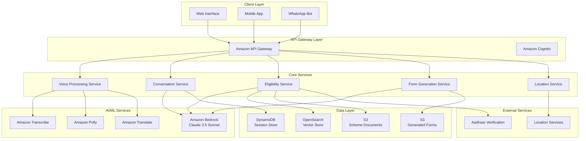

# Design Document: JanSeva AI

## Overview

JanSeva AI is a serverless, voice-first AI assistant built on AWS that helps Indian citizens access government welfare schemes through natural conversation. The system leverages Amazon Bedrock's Claude 3.5 Sonnet for intelligent conversation, combined with AWS speech services for multilingual voice interaction, and a RAG (Retrieval Augmented Generation) system for accurate scheme information retrieval.

The architecture follows a microservices pattern with event-driven communication, designed to handle high concurrency while maintaining low latency for rural users with limited connectivity. The system processes voice input in 10+ Indian languages, performs intelligent eligibility matching across 3,000+ schemes, and generates pre-filled application forms through conversational interaction.

## Architecture

### High-Level Architecture


```mermaid
graph TB
    subgraph "Client Layer"
        WEB[Web Interface]
        MOBILE[Mobile App]
        WHATSAPP[WhatsApp Bot]
    end
    
    subgraph "API Gateway Layer"
        APIGW[Amazon API Gateway]
        COGNITO[Amazon Cognito]
    end
    
    subgraph "Core Services"
        VOICE[Voice Processing Service]
        CONV[Conversation Service]
        ELIG[Eligibility Service]
        FORM[Form Generation Service]
        LOC[Location Service]
    end
    
    subgraph "AI/ML Services"
        BEDROCK[Amazon Bedrock<br/>Claude 3.5 Sonnet]
        TRANSCRIBE[Amazon Transcribe]
        POLLY[Amazon Polly]
        TRANSLATE[Amazon Translate]
    end
    
    subgraph "Data Layer"
        DYNAMO[DynamoDB<br/>Session Store]
        S3SCHEMES[S3<br/>Scheme Documents]
        OPENSEARCH[OpenSearch<br/>Vector Store]
        S3FORMS[S3<br/>Generated Forms]
    end
    
    subgraph "External Services"
        AADHAAR[Aadhaar Verification]
        MAPS[Location Services]
    end
    
    WEB --> APIGW
    MOBILE --> APIGW
    WHATSAPP --> APIGW
    
    APIGW --> VOICE
    APIGW --> CONV
    APIGW --> ELIG
    APIGW --> FORM
    APIGW --> LOC
    
    VOICE --> TRANSCRIBE
    VOICE --> POLLY
    VOICE --> TRANSLATE
    
    CONV --> BEDROCK
    ELIG --> BEDROCK
    ELIG --> OPENSEARCH
    
    FORM --> BEDROCK
    FORM --> S3FORMS
    
    CONV --> DYNAMO
    ELIG --> S3SCHEMES
    LOC --> MAPS
    
    ELIG --> AADHAAR
```

### Service Architecture Pattern

Each core service follows a consistent serverless pattern:
- **AWS Lambda** functions for compute
- **Amazon EventBridge** for service communication
- **Amazon DynamoDB** for session state
- **Amazon S3** for document storage
- **Amazon CloudWatch** for monitoring and logging

## Components and Interfaces

### Voice Processing Service

**Responsibilities:**
- Convert speech to text using Amazon Transcribe
- Convert text to speech using Amazon Polly
- Handle language detection and switching
- Optimize audio for low-bandwidth connections

**Key Interfaces:**
```typescript
interface VoiceProcessingService {
  transcribeAudio(audioData: Buffer, languageHint?: string): Promise<TranscriptionResult>
  synthesizeSpeech(text: string, language: string, voiceId: string): Promise<AudioBuffer>
  detectLanguage(audioData: Buffer): Promise<LanguageDetectionResult>
  optimizeForBandwidth(audioData: Buffer, targetBitrate: number): Promise<Buffer>
}

interface TranscriptionResult {
  text: string
  confidence: number
  detectedLanguage: string
  alternatives?: string[]
}
```

**Implementation Details:**
- Uses Amazon Transcribe with support for Hindi, Bengali, Telugu, Tamil, Marathi, Gujarati, Kannada, Malayalam, Punjabi, and Odia
- Implements automatic language identification for seamless language switching
- Applies audio compression for 2G network optimization
- Maintains voice preference per session in DynamoDB

### Conversation Service

**Responsibilities:**
- Manage conversation flow and context
- Interface with Claude 3.5 Sonnet for natural language understanding
- Maintain session state and conversation history
- Handle conversation branching for different user intents

**Key Interfaces:**
```typescript
interface ConversationService {
  processMessage(sessionId: string, message: string, context: ConversationContext): Promise<ConversationResponse>
  initializeSession(userId?: string, language: string): Promise<SessionInfo>
  updateContext(sessionId: string, updates: Partial<ConversationContext>): Promise<void>
  endSession(sessionId: string): Promise<void>
}

interface ConversationContext {
  currentIntent: 'discovery' | 'explanation' | 'application' | 'guidance'
  userProfile: UserProfile
  eligibleSchemes: SchemeInfo[]
  selectedScheme?: SchemeInfo
  collectedData: Record<string, any>
  language: string
  conversationHistory: Message[]
}
```

**Implementation Details:**
- Leverages Claude 3.5 Sonnet via Amazon Bedrock for natural conversation
- Implements conversation state machine with clear intent transitions
- Uses DynamoDB for session persistence with 7-day TTL
- Supports conversation resumption across sessions

### Eligibility Service

**Responsibilities:**
- Determine scheme eligibility based on user responses
- Query scheme database using RAG architecture
- Rank eligible schemes by relevance and benefit amount
- Handle complex eligibility logic with multiple criteria

**Key Interfaces:**
```typescript
interface EligibilityService {
  checkEligibility(userProfile: UserProfile): Promise<EligibilityResult[]>
  getSchemeDetails(schemeId: string, language: string): Promise<SchemeDetails>
  searchSchemes(query: string, filters: SchemeFilters): Promise<SchemeInfo[]>
  updateSchemeDatabase(schemes: SchemeDocument[]): Promise<void>
}

interface EligibilityResult {
  scheme: SchemeInfo
  eligibilityScore: number
  matchingCriteria: string[]
  missingRequirements: string[]
  estimatedBenefit: number
}
```

**Implementation Details:**
- Uses OpenSearch with Cohere multilingual embeddings for semantic search
- Implements rule-based eligibility engine with fuzzy matching
- Caches frequently accessed scheme data in DynamoDB
- Updates scheme information from government APIs daily

### Form Generation Service

**Responsibilities:**
- Generate pre-filled PDF application forms
- Map conversational data to form fields
- Validate form completeness and accuracy
- Handle multiple form formats per scheme

**Key Interfaces:**
```typescript
interface FormGenerationService {
  generateForm(schemeId: string, userData: UserData, language: string): Promise<FormResult>
  validateFormData(schemeId: string, userData: UserData): Promise<ValidationResult>
  getRequiredFields(schemeId: string): Promise<FormField[]>
  previewForm(schemeId: string, userData: UserData): Promise<FormPreview>
}

interface FormResult {
  formUrl: string
  completionPercentage: number
  missingFields: FormField[]
  validationErrors: ValidationError[]
  referenceNumber: string
}
```

**Implementation Details:**
- Uses PDF generation libraries with Indian language font support
- Stores form templates in S3 with versioning
- Implements field mapping logic for different government form formats
- Generates unique reference numbers for tracking

### Location Service

**Responsibilities:**
- Find nearest Common Service Centers (CSCs)
- Provide office hours and contact information
- Calculate travel time and directions
- Handle location-based scheme variations

**Key Interfaces:**
```typescript
interface LocationService {
  findNearestCSCs(location: GeoLocation, radius: number): Promise<ServiceCenter[]>
  getOfficeDetails(centerId: string): Promise<OfficeDetails>
  calculateTravelTime(from: GeoLocation, to: GeoLocation): Promise<TravelInfo>
  getLocationBasedSchemes(location: GeoLocation): Promise<SchemeInfo[]>
}

interface ServiceCenter {
  id: string
  name: string
  address: string
  location: GeoLocation
  services: string[]
  hours: OperatingHours
  contact: ContactInfo
  distance: number
}
```

**Implementation Details:**
- Integrates with mapping services for location data
- Maintains CSC database with regular updates
- Implements geospatial queries using DynamoDB Global Secondary Indexes
- Caches location data for performance optimization

## Data Models

### Core Data Structures

```typescript
interface UserProfile {
  demographics: {
    age: number
    gender: 'male' | 'female' | 'other'
    category: 'general' | 'obc' | 'sc' | 'st'
    maritalStatus: 'single' | 'married' | 'widowed' | 'divorced'
  }
  location: {
    state: string
    district: string
    block?: string
    village?: string
    pincode: string
    coordinates?: GeoLocation
  }
  occupation: {
    type: 'farmer' | 'student' | 'unemployed' | 'employed' | 'self-employed' | 'retired'
    sector?: string
    income?: number
    landHolding?: number
  }
  family: {
    size: number
    dependents: number
    children: number
    elderlyMembers: number
  }
  documents: {
    aadhaar: boolean
    pan: boolean
    bankAccount: boolean
    rationCard: boolean
    incomeCertificate: boolean
    casteCertificate: boolean
  }
}

interface SchemeInfo {
  id: string
  name: string
  nameTranslations: Record<string, string>
  description: string
  descriptionTranslations: Record<string, string>
  department: string
  category: 'agriculture' | 'education' | 'health' | 'employment' | 'housing' | 'social-security'
  eligibilityCriteria: EligibilityCriteria
  benefits: BenefitInfo
  applicationProcess: ApplicationStep[]
  requiredDocuments: DocumentRequirement[]
  geographicScope: 'national' | 'state' | 'district' | 'block'
  targetStates?: string[]
  isActive: boolean
  lastUpdated: Date
}

interface EligibilityCriteria {
  age?: { min?: number, max?: number }
  gender?: string[]
  category?: string[]
  income?: { max?: number, type: 'annual' | 'monthly' }
  occupation?: string[]
  landHolding?: { max?: number, unit: 'acres' | 'hectares' }
  location?: LocationCriteria
  customRules?: Rule[]
}

interface ConversationSession {
  sessionId: string
  userId?: string
  language: string
  startTime: Date
  lastActivity: Date
  currentIntent: string
  context: ConversationContext
  messages: Message[]
  userProfile?: UserProfile
  eligibleSchemes: string[]
  selectedScheme?: string
  formData: Record<string, any>
  status: 'active' | 'completed' | 'abandoned'
  ttl: number
}
```

### Database Schema

**DynamoDB Tables:**

1. **Sessions Table**
   - Partition Key: `sessionId`
   - TTL: 7 days
   - GSI: `userId-lastActivity-index`

2. **Schemes Table**
   - Partition Key: `schemeId`
   - Sort Key: `version`
   - GSI: `category-lastUpdated-index`
   - GSI: `state-category-index`

3. **User Analytics Table**
   - Partition Key: `date`
   - Sort Key: `userId#sessionId`
   - Attributes: anonymized usage metrics

**OpenSearch Indexes:**

1. **Schemes Index**
   - Documents: scheme information with multilingual embeddings
   - Fields: name, description, eligibility criteria, benefits
   - Embeddings: Cohere multilingual model

2. **FAQ Index**
   - Documents: frequently asked questions and answers
   - Fields: question, answer, category, language
   - Embeddings: semantic search capability

## Correctness Properties

*A property is a characteristic or behavior that should hold true across all valid executions of a system—essentially, a formal statement about what the system should do. Properties serve as the bridge between human-readable specifications and machine-verifiable correctness guarantees.*

Based on the prework analysis, here are the consolidated correctness properties:

**Property 1: Voice Processing Completeness**
*For any* text input in a supported Indian language, the Voice_Interface should successfully generate audio output, and for any audio input in a supported language, the system should produce text transcription with measurable confidence scores.
**Validates: Requirements 1.1, 1.2, 1.5**

**Property 2: Language Support Consistency**
*For any* of the 10 specified Indian languages (Hindi, Bengali, Telugu, Marathi, Tamil, Gujarati, Urdu, Kannada, Odia, Malayalam), the system should provide complete voice processing, conversation, and form generation capabilities.
**Validates: Requirements 1.3, 1.4**

**Property 3: Comprehensive Eligibility Checking**
*For any* user profile with valid demographic information, the Eligibility_Engine should query all available schemes in the database and return results ranked by benefit amount and application ease.
**Validates: Requirements 2.1, 2.2, 2.3**

**Property 4: Scheme Explanation Completeness**
*For any* set of eligible schemes, the system should generate explanations that include scheme benefits, eligibility criteria, required documents, and application process in the user's chosen language.
**Validates: Requirements 2.4, 6.3**

**Property 5: Fallback Behavior Consistency**
*For any* query that returns no matching schemes or encounters errors, the system should provide alternative suggestions, clarifying questions, or escalation options rather than failing silently.
**Validates: Requirements 2.5, 6.4, 8.2, 8.5**

**Property 6: Form Generation Round-Trip**
*For any* complete user data set for a valid scheme, generating a form and then extracting the data should preserve all the original information provided by the user.
**Validates: Requirements 3.1, 3.4**

**Property 7: Conversational Form Mapping**
*For any* form field in any supported scheme, the system should generate natural language questions and correctly map user responses back to the appropriate form fields with validation.
**Validates: Requirements 3.2, 3.3, 3.5**

**Property 8: Location Service Completeness**
*For any* valid geographic location, the system should return nearby service centers with complete information including address, hours, contact details, and travel estimates.
**Validates: Requirements 4.2, 4.3**

**Property 9: Document Guidance Consistency**
*For any* completed form or missing document scenario, the system should provide appropriate document checklists and guidance in the user's language.
**Validates: Requirements 4.1, 4.4, 4.5**

**Property 10: Privacy-First Data Handling**
*For any* session lifecycle (start, active, end), the system should handle personal data according to privacy requirements: collect consent, use data only for current session, and delete personal information upon session termination.
**Validates: Requirements 5.1, 5.3, 5.4, 5.5**

**Property 11: Session Continuity**
*For any* interrupted session with saved progress, resuming the session should restore the previous state and allow the user to continue from where they left off, with appropriate confirmation of previously provided information.
**Validates: Requirements 7.1, 7.2, 7.3, 7.5**

**Property 12: Reference Number Uniqueness**
*For any* completed application, the system should generate a unique reference number that can be used for tracking and no two applications should ever receive the same reference number.
**Validates: Requirements 7.4**

**Property 13: Error Recovery Completeness**
*For any* system error or failure condition, the system should provide appropriate error messages in the user's language and offer alternative paths to complete their task.
**Validates: Requirements 8.1, 8.3, 8.4**

**Property 14: Performance Under Constraints**
*For any* voice interaction under bandwidth or processing constraints, the system should complete responses within specified time limits (3 seconds for voice, 10 seconds for eligibility, 15 seconds for forms).
**Validates: Requirements 9.1, 9.4, 9.5**

**Property 15: Analytics Data Integrity**
*For any* user interaction, the system should record appropriate anonymized metrics while ensuring no personally identifiable information is stored in analytics data.
**Validates: Requirements 10.1, 10.2, 10.3, 10.4, 10.5**

<function_calls>
<invoke name="prework">
<parameter name="featureName">janseva-ai

## Error Handling

### Error Categories and Responses

**Voice Processing Errors:**
- Speech recognition failures → Request repetition or offer text input
- Audio quality issues → Suggest better microphone positioning or quieter environment
- Language detection failures → Ask user to specify their preferred language
- Network connectivity issues → Switch to text mode or offline capabilities

**Conversation Errors:**
- Intent recognition failures → Ask clarifying questions with multiple choice options
- Context loss → Summarize current progress and ask for confirmation
- Claude API failures → Fall back to rule-based responses for common queries
- Session timeout → Offer to resume previous session or start fresh

**Eligibility Processing Errors:**
- Incomplete user profile → Ask specific follow-up questions for missing information
- Scheme database unavailability → Use cached data with appropriate disclaimers
- Complex eligibility rule failures → Escalate to human verification
- Data validation errors → Provide specific guidance on correct format

**Form Generation Errors:**
- Missing required fields → Guide user through completing missing information
- PDF generation failures → Offer alternative formats or manual form completion
- Template unavailability → Use generic form template with manual field mapping
- Data mapping errors → Ask user to verify and correct specific information

**System-Level Errors:**
- Service unavailability → Provide alternative contact methods and expected resolution time
- Database connectivity issues → Use read replicas or cached data where possible
- Authentication failures → Guide through re-authentication process
- Rate limiting → Queue requests and provide estimated wait times

### Error Recovery Strategies

1. **Graceful Degradation**: System continues operating with reduced functionality
2. **Automatic Retry**: Transient errors are retried with exponential backoff
3. **User Guidance**: Clear instructions for resolving user-correctable errors
4. **Human Escalation**: Complex issues are escalated to human operators
5. **Offline Capability**: Critical functions work without internet connectivity

## Testing Strategy

### Dual Testing Approach

The testing strategy employs both unit testing and property-based testing as complementary approaches:

**Unit Tests** focus on:
- Specific examples and edge cases
- Integration points between services
- Error conditions and boundary cases
- Mock external service responses
- Language-specific behavior validation

**Property-Based Tests** focus on:
- Universal properties across all inputs
- Comprehensive input coverage through randomization
- Invariant preservation across operations
- Round-trip consistency for data transformations
- Performance characteristics under various conditions

### Property-Based Testing Configuration

**Framework Selection**: 
- **JavaScript/TypeScript**: fast-check library
- **Python**: Hypothesis library
- **Java**: QuickCheck for Java (junit-quickcheck)

**Test Configuration**:
- Minimum 100 iterations per property test
- Custom generators for Indian names, addresses, and demographic data
- Multilingual text generators for all supported languages
- Audio sample generators for voice testing
- Geographic coordinate generators for location testing

**Property Test Tagging**:
Each property-based test must include a comment referencing its design document property:
```typescript
// Feature: janseva-ai, Property 1: Voice Processing Completeness
// Feature: janseva-ai, Property 6: Form Generation Round-Trip
```

### Test Data Management

**Synthetic Data Generation**:
- Indian demographic profiles with realistic distributions
- Government scheme data with varied eligibility criteria
- Multilingual text samples for conversation testing
- Audio samples in supported Indian languages
- Geographic data covering rural and urban locations

**Privacy-Compliant Testing**:
- No real citizen data used in testing
- Synthetic Aadhaar numbers for verification testing
- Anonymized usage patterns for analytics testing
- Compliance with data protection requirements

### Integration Testing Strategy

**Service Integration Tests**:
- End-to-end conversation flows
- Cross-service data consistency
- External API integration reliability
- Performance under realistic load conditions

**User Journey Testing**:
- Complete eligibility discovery to form submission flows
- Multi-session application completion scenarios
- Error recovery and fallback behavior validation
- Accessibility compliance across all interfaces

### Performance Testing

**Load Testing Scenarios**:
- 1,000 concurrent voice sessions
- Peak usage during government scheme announcements
- Rural connectivity simulation (2G network conditions)
- Database query performance under high scheme volume

**Monitoring and Alerting**:
- Response time monitoring for all critical paths
- Error rate tracking by service and language
- User satisfaction metrics and feedback analysis
- System resource utilization and scaling triggers